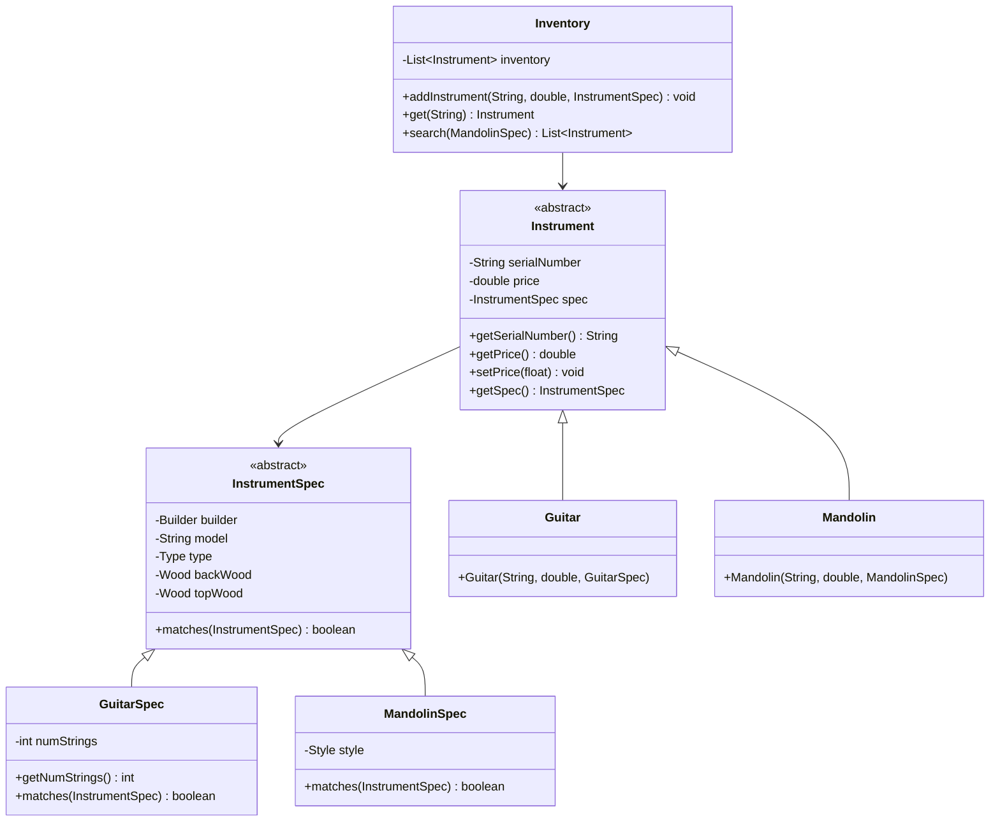
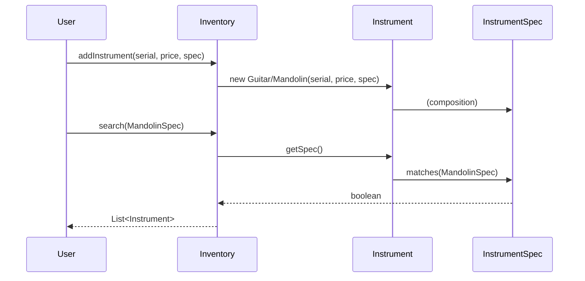

# Musical Instruments Inventory System (Part 2)

This project implements an extensible, object-oriented inventory system for musical instruments. It demonstrates advanced design principles such as inheritance, encapsulation, abstraction, and polymorphism, supporting multiple instrument types (e.g., guitars, mandolins) and their specifications.

---

## System Overview

The system manages a collection of musical instruments, allowing users to add, retrieve, and search for instruments based on detailed specifications. It is designed for flexibility and future expansion to support new instrument types.

---

## Class Structure

### Main Classes

- **Instrument**: Abstract base class for all instruments. Stores serial number, price, and a reference to its specification.
- **InstrumentSpec**: Abstract base class for instrument specifications. Stores common attributes (builder, model, type, woods).
- **Guitar**: Concrete subclass of `Instrument` for guitars.
- **GuitarSpec**: Subclass of `InstrumentSpec` for guitar-specific attributes (e.g., number of strings).
- **Mandolin**: Concrete subclass of `Instrument` for mandolins.
- **MandolinSpec**: Subclass of `InstrumentSpec` for mandolin-specific attributes (e.g., style).
- **Inventory**: Manages a collection of instruments. Supports adding, retrieving, and searching instruments.

### Supporting Types

- **Builder**: Enum for instrument builders (e.g., FENDER, MARTIN).
- **Type**: Enum for instrument types (ACOUSTIC, ELECTRIC).
- **Wood**: Enum for wood types.
- **Style**: Enum for mandolin styles (A, F).

---

## UML Class Diagram



---

## Sequence Diagram: Adding and Searching Instruments



---

## Key Features

- **Extensible Design**: Easily add new instrument types and specifications.
- **Encapsulation**: All fields are private with public getters/setters.
- **Inheritance & Polymorphism**: Abstract base classes and method overriding.
- **Flexible Search**: Search for instruments by matching detailed specifications.
- **Type Safety**: Uses generics and enums for clarity and safety.

---

## Usage Example

```java
// Create inventory
Inventory inventory = new Inventory();

// Add a guitar
inventory.addInstrument(
    "11277", 3999.95,
    new GuitarSpec(Builder.COLLINGS, "CJ", Type.ACOUSTIC, Wood.INDIAN_ROSEWOOD, Wood.SITKA, 6)
);

// Add a mandolin
inventory.addInstrument(
    "M95693", 1499.95,
    new MandolinSpec(Builder.FENDER, "FM-52E", Type.ACOUSTIC, Wood.MAPLE, Wood.MAPLE, Style.A)
);

// Search for mandolins with specific spec
MandolinSpec whatErinLikes = new MandolinSpec(
    Builder.FENDER, "FM-52E", Type.ACOUSTIC, Wood.MAPLE, Wood.MAPLE, Style.A
);
List<Instrument> matchingMandolins = inventory.search(whatErinLikes);
```

---

## Design Principles Demonstrated

- **Single Responsibility**: Each class has a clear, focused purpose.
- **Open/Closed Principle**: System is open for extension, closed for modification.
- **Abstraction**: Abstract classes define common interfaces and behaviors.
- **Code Reuse**: Shared logic in base classes, specific logic in subclasses.

---

## Extending the System

To add a new instrument type:
1. Create a new subclass of `Instrument` (e.g., `Violin`).
2. Create a corresponding spec subclass (e.g., `ViolinSpec`).
3. Update `Inventory.addInstrument` and `search` methods as needed.

---

## File Overview

- [Instrument.java](Instrument.java)
- [InstrumentSpec.java](InstrumentSpec.java)
- [Guitar.java](Guitar.java)
- [GuitarSpec.java](GuitarSpec.java)
- [Mandolin.java](Mandolin.java)
- [MandolinSpec.java](MandolinSpec.java)
- [Inventory.java](Inventory.java)
- [Style.java](Style.java)
- [../Builder.java](../Builder.java)
- [../Type.java](../Type.java)
- [../Wood.java](../Wood.java)

---