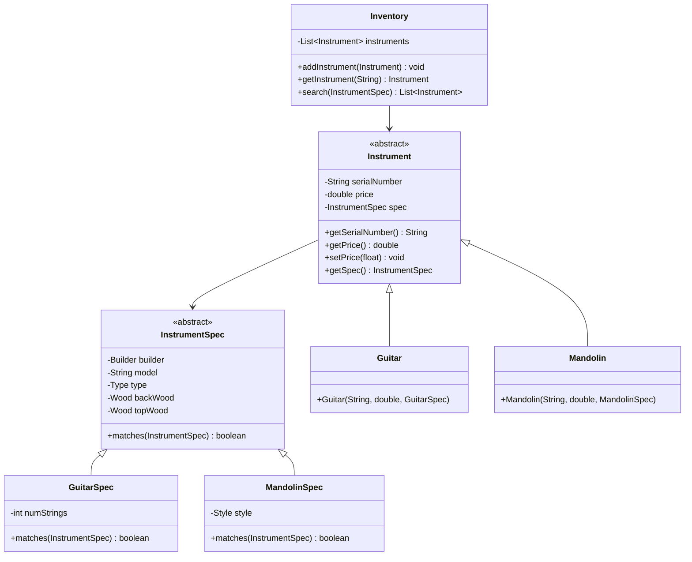

# Musical Instruments Inventory System

This project implements a well-designed object-oriented system for managing musical instruments inventory. The system follows good design principles and demonstrates proper use of inheritance, encapsulation, and abstraction.

## Class Structure

## Key Features

1. **Abstract Base Classes**
   - `Instrument`: Base class for all musical instruments
   - `InstrumentSpec`: Base class for instrument specifications

2. **Concrete Implementations**
   - `Guitar` and `GuitarSpec`: For guitar-specific attributes
   - `Mandolin` and `MandolinSpec`: For mandolin-specific attributes

3. **Inventory Management**
   - `Inventory` class for managing the collection of instruments
   - Search functionality based on instrument specifications
   - Add and retrieve instruments

## Design Principles

1. **Encapsulation**
   - Private fields with public getters/setters
   - Proper data hiding

2. **Inheritance**
   - Clear hierarchy for instruments and their specifications
   - Code reuse through abstract classes

3. **Abstraction**
   - Abstract classes defining common behavior
   - Interface-based design for flexibility

4. **Single Responsibility**
   - Each class has a specific purpose
   - Clear separation of concerns

## Usage

The system allows for:
- Adding new instruments to inventory
- Searching for instruments based on specifications
- Managing different types of instruments (Guitars, Mandolins)
- Maintaining instrument details and specifications 