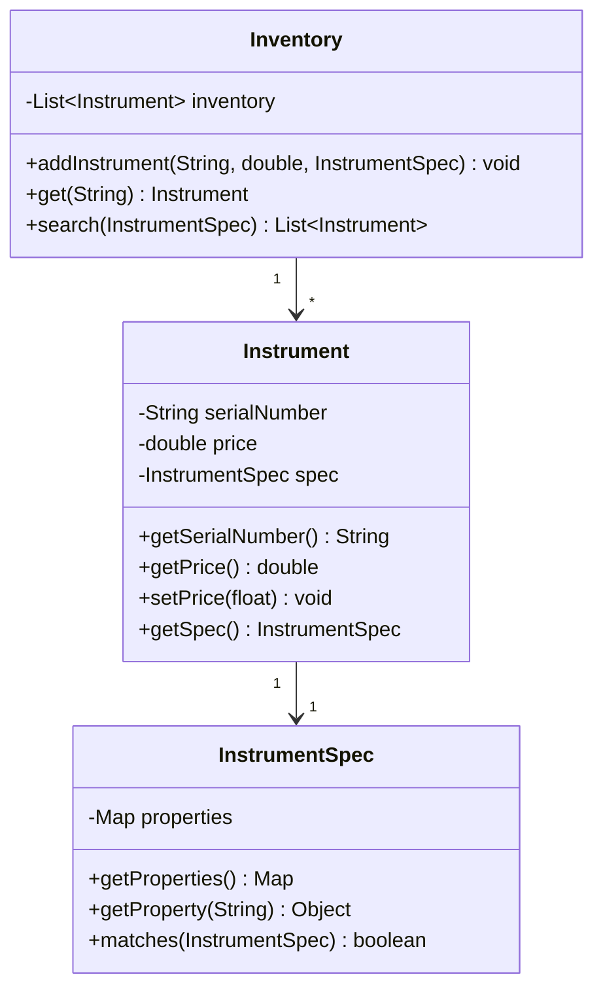
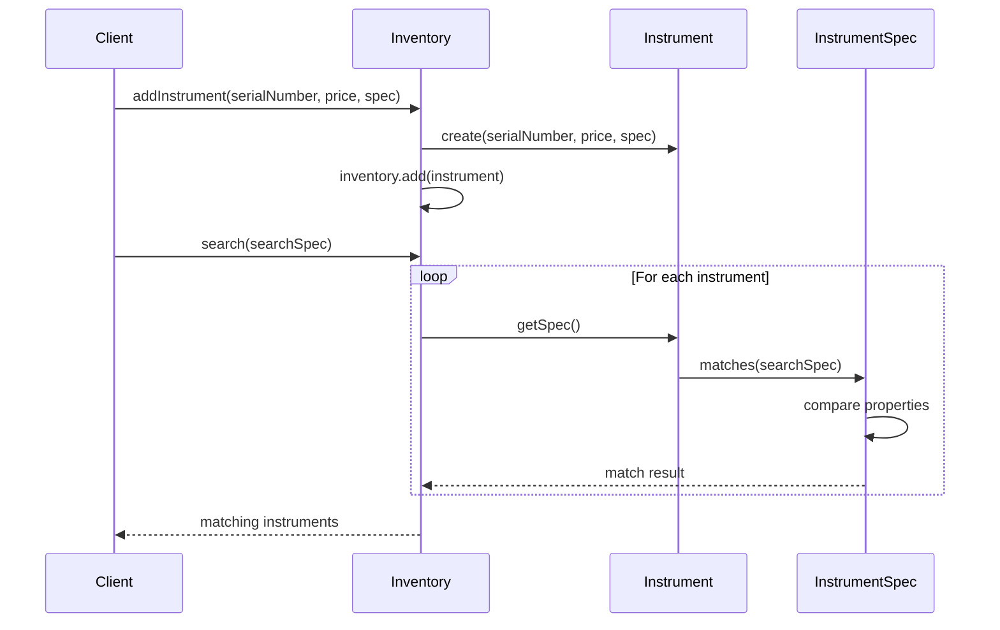

# Instrument Shop Management System

This project implements a flexible instrument management system that allows storing and searching musical instruments based on their specifications.

## Project Structure

The system consists of three main classes:
- `Instrument`: Represents a musical instrument with a serial number, price, and specifications
- `InstrumentSpec`: Handles the flexible specification system using property maps
- `Inventory`: Manages the collection of instruments and provides search capabilities

## Key Features

- Flexible specification system using property maps
- Search instruments by multiple criteria
- Add new instruments to inventory
- Retrieve instruments by serial number
- Price management for instruments

## Class Diagram



## Sequence Diagram



## Usage Example

```java
// Create an instrument specification
Map<String, Object> properties = new HashMap<>();
properties.put("instrumentType", "guitar");
properties.put("builder", "Gibson");
properties.put("model", "Les Paul");
InstrumentSpec spec = new InstrumentSpec(properties);

// Add instrument to inventory
Inventory inventory = new Inventory();
inventory.addInstrument("123456", 1999.99, spec);

// Search for instruments
List<Instrument> matchingInstruments = inventory.search(spec);
```

## Technical Details

- Uses Java Collections Framework (List, Map)
- Implements flexible property matching system
- Follows SOLID principles
- Supports extensibility through property-based specifications

## Design Patterns Used

- **Encapsulation**: All classes properly encapsulate their internal state
- **Composition**: Instrument contains InstrumentSpec
- **Iterator**: Used in the specification matching process