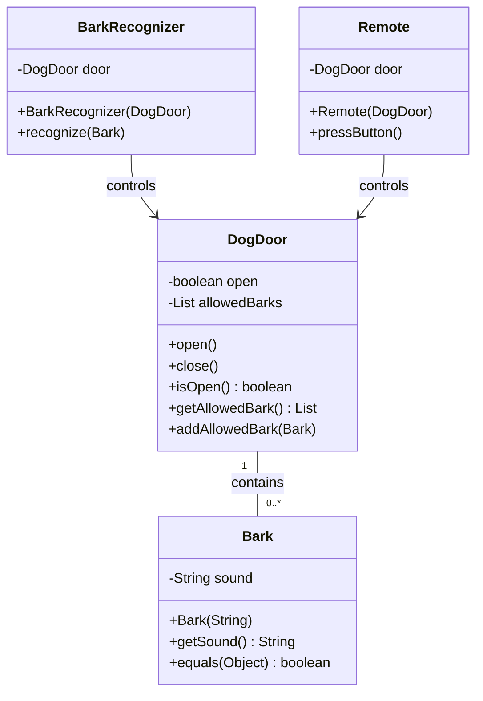
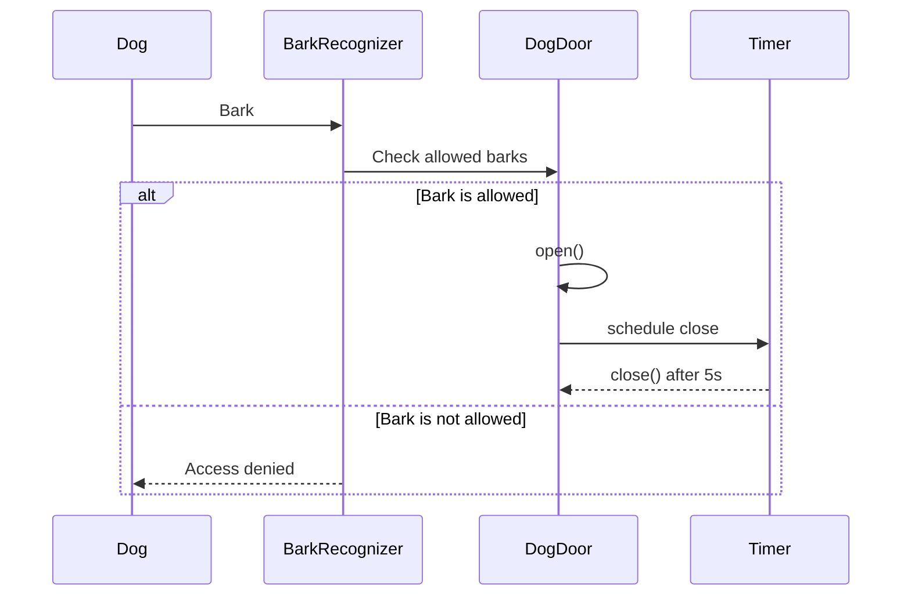

# Doug's Dog Door System

This project implements an automated dog door system that can be controlled either by a remote control or by recognizing specific dog barks. The system is designed to be secure and convenient, allowing only authorized dogs to enter through voice recognition.

## System Components

### 1. DogDoor
- Core component that manages the physical door state
- Maintains a list of allowed barks
- Automatically closes after 5 seconds of being opened
- Provides methods to open and close the door

### 2. Bark
- Represents a dog's bark sound
- Implements equals() method for bark comparison
- Case-insensitive bark matching

### 3. BarkRecognizer
- Listens for barks and validates them against allowed barks
- Controls the door based on bark recognition
- Connected to the DogDoor for operation

### 4. Remote
- Provides manual control of the dog door
- Toggles door state (open/close) when button is pressed

## UML Class Diagram



## Sequence Diagram



## Features

1. **Automatic Door Control**
   - Door opens automatically when an authorized bark is recognized
   - Door closes automatically after 5 seconds
   - Manual control through remote

2. **Bark Recognition**
   - Supports multiple authorized barks per dog
   - Case-insensitive bark matching
   - Secure access control

3. **Remote Control**
   - Manual override capability
   - Toggle door state with button press

## Usage Example

```java
// Create and configure the dog door
DogDoor door = new DogDoor();
door.addAllowedBark(new Bark("rowlf"));
door.addAllowedBark(new Bark("rooowlf"));

// Set up bark recognition
BarkRecognizer recognizer = new BarkRecognizer(door);

// Set up remote control
Remote remote = new Remote(door);

// Use the system
recognizer.recognize(new Bark("rowlf")); // Door opens
remote.pressButton(); // Manual control
```

## Thread Safety

The system is designed to be thread-safe, with proper synchronization for door operations and bark recognition. All operations are logged with thread information for debugging purposes. 